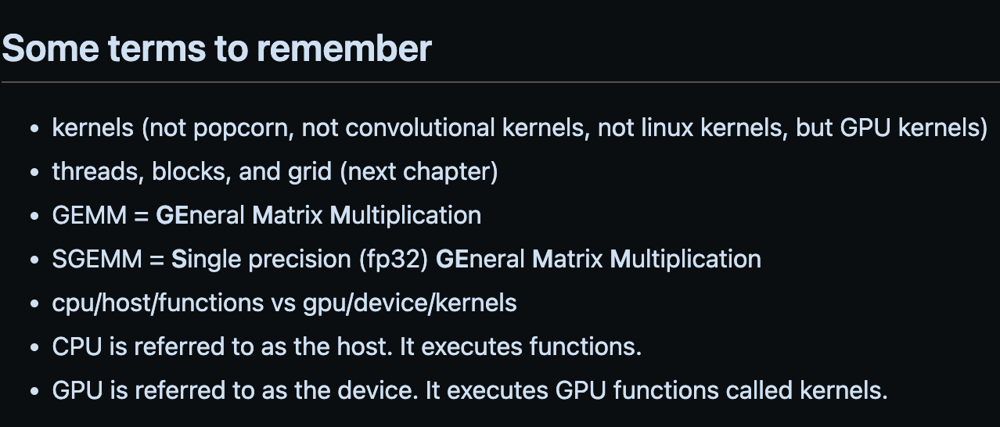

# CUDA Programming Course – High-Performance Computing with GPUs

This course is provided by Elliot Arledge.

[Course Link](https://youtu.be/86FAWCzIe_4)
[Github - CUDA course](https://github.com/Infatoshi/cuda-course)
[Github - MNIST](https://github.com/Infatoshi/mnist-cuda)

## Chapter 00 - Intro

### Prerequisites

- Access to GPU
- Python
- Basic differentiation
- Vector calculus
- Linear algebra

### Takeaways

The main GPU performance bottleneck is memory bandwidth — the communication between chips and inside chips. We will try to optimize it.

Another hard things to do is how to bring a new algorithm to life, like implementing it on PyTorch. We will do it, too.

And we will learn Karpathy's llm.c [![Karpathy's llm.c repository][github]](https://github.com/karpathy/llm.c).

## Chapter 01 - Deep Learning Ecosystem

Note book here: [![notebook][github]](https://github.com/Infatoshi/cuda-course/tree/master/01_Deep_Learning_Ecosystem)

### Research

- **PyTorch** (by Meta): Learn PyTorch at [![Learn PyTorch][yt]](https://youtu.be/Z_ikDlimN6A)
- TensorFlow (by Google)
- Keras: TensorFlow's version of `PyTorch.nn`
- JAX (by Google): used to accelerate linear algebra. JAX is almost identical to NumPy [![JAX in 100 seconds][yt]](https://youtu.be/_0D5lXDjNpw). X: accelerate; A: Autograd, allows you to automatically differentiate functions; J: JIT (Just-in-Time) - compilation. Notice that JAX arrays are immutable.
- MLX (by Apple): for Apple Silicon
- PyTorch Lightning: reduce boilerplate code.

### Production

Training and inference.

- Inference-only
  - vLLM
  - TensorRT (by Nvidia)
- Triton (by OpenAI)
- torch.compile: can increase performance by 30% with just one line
- TorchScript (old)
- ONNX Runtime (by Microsoft)
- Detectron2 (by Meta)

### Low-Level

- **CUDA** (for Nvidia GPUs)
- ROCm (for AMD GPUs)
- OpenCL

### Inference for Edge Computing & Embedded Systems

Edge computing: de-centralized computing.

- CoreML (for Apple devices)
- PyTorch Mobile
- TensorFlow Lite

### Easy to Use

- FastAI
- ONNX (Open Neural Network eXchange)
- wandb (weights and biases)

### Cloud Providers

- **AWS**
- Google Cloud
- Microsoft Azure
- OpenAI
- VastAI
- Lambda Labs

### Compilers

- XLA: for JAX
- LLVM: for C/C++
- MLIR
- **NVCC: Nvidia CUDA Compiler**

### Misc

- [**Huggingface**](https://huggingface.co/)

## Chapter 02 - CUDA Setup

WSL -> python3 -> cuda toolkit and nvidia driver (follow the [Nvidia instructions](https://docs.nvidia.com/cuda/wsl-user-guide/index.html)).

For WSL, only install driver on Windows. Use `nvidia-smi` to check if driver is installed successfully. `CUDA version` is the maximum supported CUDA version.

Use `nvcc --version` to check if CUDA toolkit is installed successfully. This version should be less than or equal to the `CUDA version` shown in `nvidia-smi`.

## Chapter 03 - C/C++ Review

My C++ repository: [![C++ repo][github]](https://github.com/iktCalT/cpp-learning-journey)

For a large tensor, `int` is not enough to iterate through it. Use `size_t` (the maximum size of a theoretically possible object of any type. On my PC, it's `unsigned long long`) instead.

### Makefile & CMakeLists

cmake combined with `CMakeLists.txt` can be used to generate Makefile automatically.

For example:

```makefile
# Copied from https://github.com/Infatoshi/cuda-course/blob/master/03_C_and_C%2B%2B_Review/06%20Makefiles/Makefile

# Note: 01.c, 02.c, 03.cu are 3 files in the same directory with this Makefile

.PHONY: 01 01_obj 01_obj_exe_run 02 03 clean

GCC = gcc
NVCC = nvcc
CUDA_FLAGS = -arch=sm_86

01:
  @$(GCC) -o 01 01.c


# just compiles to object file
01_obj:
  @$(GCC) -c 01.c -o 01.o

# compiles and runs the object file (ensure 01_obj is up to 
# date by running 01_obj first if it hasn't been run yet)
01_obj_exe_run: 01_obj
  @$(GCC) 01.o -o 01
  @./01

02:
  @$(GCC) -o 02 02.c

03: 
  @$(NVCC) $(CUDA_FLAGS) -o 03_cu 03.cu

clean: 
  rm -f 01 02 03_cu *.o
```

- **`.PHONY`**: Phony targets are useful for avoiding conflicts with files of the same name and improving performance.
- **Difference between `=` and `:=`**: `a = b` is more like `int& a = b` in C++, and `a := b` is like `int a = b` in C++. `=` doesn't create any copy, both variables are stored at the same place. While `:=` creates a copy.

### Debugger

Read [Missing Semester Lecture 4](https://missing.csail.mit.edu/2026/debugging-profiling/) or [CSAPP](https://csapp.cs.cmu.edu/3e/students.html) to learn gdb.

## Chapter 04 - Intro to GPUs

Although GPU's clock speed is slower than CPU's, it    calculates faster because usually, GPUs have much more cores than CPUs.

TPUs are specialized GPUs for deep learning algorithms. "T": tensor.

FPGA: chips can be programmed. Be used for specific tasks. Very expensive.

### What makes GPUs so fast for deep learning

[![The Benefits of Using GPUs][nv]](https://docs.nvidia.com/cuda/cuda-programming-guide/01-introduction/introduction.html#the-benefits-of-using-gpus)

[![What makes GPUs so fast][github]](https://github.com/Infatoshi/cuda-course/tree/master/04_Gentle_Intro_to_GPUs#what-makes-gpus-so-fast-for-deep-learning)

### Terms

- CPU (host)
- GPU (device)

In a typical CUDA program (following is copied from [course note](https://github.com/Infatoshi/cuda-course/tree/master/04_Gentle_Intro_to_GPUs#what-makes-gpus-so-fast-for-deep-learning)):

- CPU allocates CPU memory
- CPU copies data to GPU
- CPU launches kernel on GPU (processing is done here)
- CPU copies results from GPU back to CPU to do something useful with it

GPU kernels are GPU's version of CPU functions. They are functions with `__global__` in CUDA.

```c++
__global__ void vecAdd(const float* A, const float* B, float* C, int N) {
  int idx = threadIdx.x + blockIdx.x * blockDim.x;
  if (idx < N) {
  C[idx] = A[idx] + B[idx];
}
}
```

#### Other terms



GEMMs are multiplications like `C = αAB + βC`.

## Chapter 05 - Writing your First Kernels


<!----------- References ----------->
[yt]: https://img.shields.io/badge/YouTube-%23FF0000.svg?style=flat-square&logo=YouTube&logoColor=white
[github]: https://img.shields.io/badge/-Github-white?style=flat&logo=github&logoColor=181717
[nv]: https://img.shields.io/badge/-Nvidia-white?style=flat&logo=nvidia&logoColor=76B900
